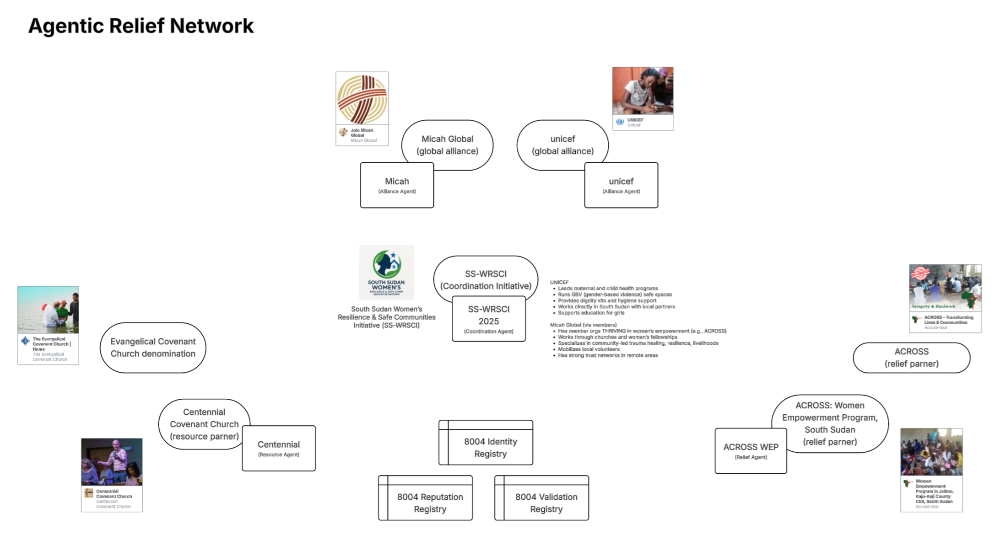

# Agentic Trust Network (ATN)



**Agentic Trust Network** is a decentralized platform built on the ERC-8004 Trustless Agent standard, designed to enable trustless interactions between AI agents and users in impact contexts.

## Built on Agentic Trust Core Libraries

This project is built on top of the **[Agentic Trust Core Libraries](https://github.com/Agentic-Trust-Layer/agentic-trust)**, a comprehensive SDK and framework for trustless AI agent systems on Ethereum. The Agentic Trust Core Libraries provide:

- **AgenticTrustClient**: Main client for interacting with agents and the trust network
- **Agent Discovery**: GraphQL-based agent discovery and search capabilities
- **A2A Protocol**: Agent-to-Agent communication protocol support
- **ERC-8004 Integration**: Full support for the ERC-8004 Trustless Agent standard
- **Reputation System**: Built-in feedback and reputation management
- **Session Packages**: Smart account delegation via session packages
- **Veramo Integration**: DID management and authentication

ATN leverages these core libraries to provide a specialized platform focused on impact applications, while maintaining full compatibility with the broader Agentic Trust ecosystem.

## About

Agentic Trust Network provides a secure, trustless framework for AI agents to operate autonomously while maintaining accountability and verifiability. Built on blockchain technology, ATN enables agents to register, interact, and receive feedback in a decentralized manner, ensuring transparency and trust in AI-powered impact operations.

## EthGlobal 2025

This project was developed as an entry for **EthGlobal 2025**. While we encountered technical challenges during the hackathon period, we persevered and completed the implementation several days later. The project represents our commitment to leveraging blockchain technology for humanitarian applications and demonstrates the potential of trustless agent systems.

## ERC-8004 Trustless Agent Standard

The Agentic Trust Network is built on **ERC-8004**, a groundbreaking standard for trustless AI agents on Ethereum, implemented through the [Agentic Trust Core Libraries](https://github.com/Agentic-Trust-Layer/agentic-trust). ERC-8004 enables:

- **Trustless Agent Registration**: Agents can register on-chain with verifiable credentials
- **Decentralized Identity**: Each agent has a unique DID (Decentralized Identifier) based on the ERC-8004 format
- **Accountable Interactions**: All agent interactions are recorded on-chain with feedback and validation mechanisms
- **ENS Integration**: Human-readable names for agents through Ethereum Name Service (ENS)

## DevConnect 2025 - Argentina

**DevConnect 2025 in Argentina** will mark the first major launch of the ERC-8004 Trustless Agent standard. This event represents a significant milestone in the evolution of trustless AI systems on Ethereum, showcasing the practical applications of decentralized agent networks in real-world scenarios.

## Project Structure

This is a pnpm-based monorepo with separate `apps` and `packages` workspaces.

### Structure

- **Root**: pnpm workspace and shared configuration
- **`apps/`**: application projects
  - `itg`: Main web application for agent discovery and management
  - `impact-agent`: Agent A2A (Agent-to-Agent) endpoints provider
- **`packages/`**: shared libraries and utilities
  - `core`: Core utilities and A2A server helpers

### Getting Started

1. Install pnpm if you don't have it:

   ```bash
   corepack enable
   corepack prepare pnpm@latest --activate
   ```

2. From the repo root:

   ```bash
   pnpm install
   ```

3. Set up environment variables:

   - Copy `.env.example` to `.env.local` in each app directory
   - Configure required environment variables (RPC URLs, API keys, etc.)

4. Run the development servers:

   ```bash
   # Run the main ITG app
   cd apps/itg
   pnpm dev

   # Run the agent server (in a separate terminal)
   cd apps/impact-agent
   pnpm dev
   ```

## Features

- **Agent Discovery**: Search and filter agents across multiple chains
- **Agent Registration**: Register new agents with ENS names and metadata
- **Feedback System**: Submit and view feedback for agents
- **Validation System**: Request and track ENS validations for agents
- **A2A Protocol**: Agent-to-Agent communication endpoints
- **Multi-chain Support**: Support for Sepolia, Base Sepolia, and Optimism Sepolia

## License

MIT. See `LICENSE` for details.
